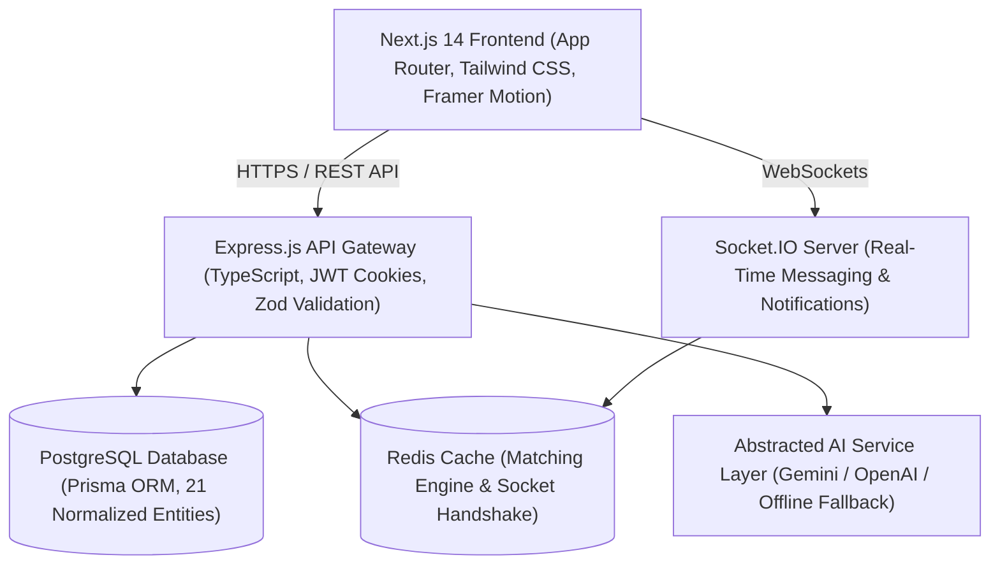

# SkillXchange

> **Tagline:** "Learn. Teach. Exchange. Grow."  
> SkillXchange is a modern skill-sharing and placement-readiness platform designed for university students, freshers, developers, and early-career professionals.

---

## 🌟 Overview & Problem Statement

University students and early-career developers often face a dual challenge: possessing valuable skills in specific tech domains (e.g. React, Node.js) while needing to acquire missing competencies (e.g. Python, Docker, System Design) for software engineering placements.

**SkillXchange** solves this problem by creating a reciprocal skill-sharing marketplace backed by:
1. **AI-Powered Skill Matching**: Calculates 0-100% compatibility scores between student mentors.
2. **Placement Readiness & Skill Gap Analyzer**: Evaluates student skill sets against software placement roles (SDE, Full-Stack, Backend, ML Engineer).
3. **Real-Time Chat & Session Scheduling**: Instant WebSocket communication & 1-on-1 video call planner.
4. **Ratings, Reputation & Badges**: Multi-criteria 5-star ratings, automated gamification achievements, and admin content moderation.

---

## 🏗 System Architecture



---

## 🚀 Technology Stack

- **Frontend**: Next.js 14 (App Router), TypeScript, Tailwind CSS, Framer Motion, TanStack Query v5, React Hook Form, Zod, Lucide Icons.
- **Backend**: Node.js, Express.js, TypeScript, Prisma ORM, Socket.IO, JWT + HTTP-only cookies, bcrypt, Redis, Helmet, Express Rate Limit.
- **Database**: PostgreSQL with 21 normalized models, UUIDs, foreign keys, cascade rules, indexing.
- **AI Integration**: Pluggable `AIService` supporting Gemini API, OpenAI API, and offline rule-engine fallback.
- **DevOps & Testing**: Docker, Docker Compose, GitHub Actions CI/CD workflows, Jest unit tests.

---

## 💻 Local Quick Start Setup

### Prerequisites
- Node.js >= 20.x
- npm >= 9.x
- PostgreSQL database instance or Docker Compose

### 1. Clone & Install Dependencies
```bash
git clone https://github.com/your-username/skillxchange.git
cd skillxchange
npm install
```

### 2. Configure Environment Variables
Copy `.env.example` to `.env`:
```bash
cp .env.example .env
```

### 3. Database Setup & Seeding
```bash
# Push database schema to PostgreSQL
npm run db:push

# Seed realistic demo data (users, skills, career roles, swaps)
npm run db:seed
```

### 4. Start Development Servers
```bash
# Runs API (port 5000) and Web Frontend (port 3000) concurrently
npm run dev
```

Visit:
- **Web App**: `http://localhost:3000`
- **Swagger API Docs**: `http://localhost:5000/api/docs`

---

## 🔐 Demo Credentials

| Role | Email | Password |
|---|---|---|
| **Student (Alex Morgan)** | `student@example.com` | `password123` |
| **Student (Sarah Chen)** | `sarah.chen@stanford.edu` | `password123` |
| **Admin Account** | `admin@example.com` | `admin123` |

---

## 🐳 Docker Setup

Run the entire full-stack application stack (PostgreSQL, Redis, Express API, Next.js Web) with single command:
```bash
docker-compose -f docker/docker-compose.yml up -d
```

---

## 🧪 Running Automated Tests

```bash
# Run unit & integration tests across workspaces
npm run test
```

---

## 📝 Placement Interview Q&A Guide

- **Why PostgreSQL instead of MongoDB?** SkillXchange relies heavily on relational integrity (users, user_skills, swap_requests, conversations, ratings, placement_readiness). Relational foreign keys and ACID transactions ensure consistency across swap state transitions.
- **How does the matching algorithm scale?** The matching service filters candidates by skill indices and university bounds before calculating reciprocal overlap, maintaining high efficiency for large candidate pools.
- **How is AI API key security guaranteed?** AI API calls are completely abstracted behind the backend `AIService` factory. Secrets are never exposed to client-side JS.
